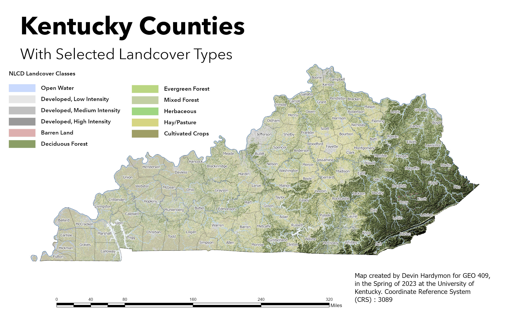
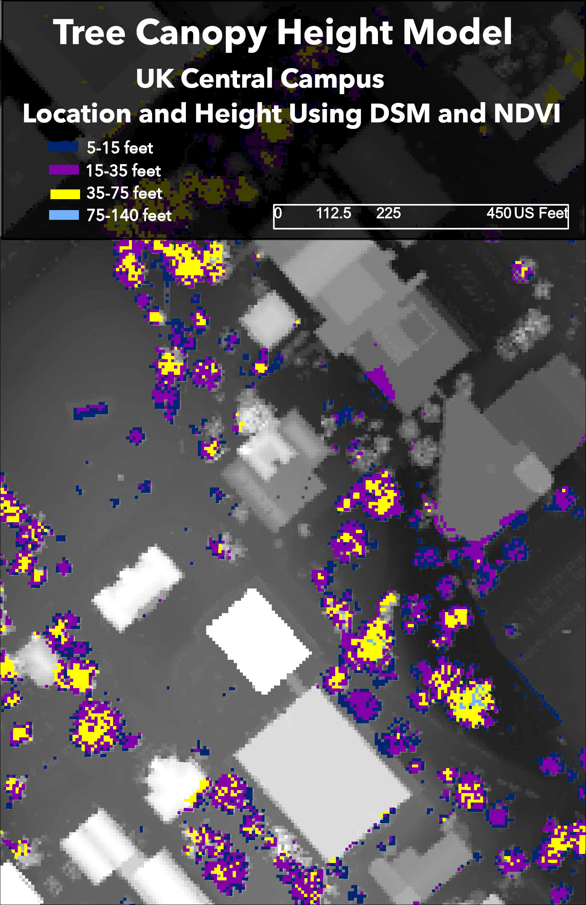

# Lab_04
# GEO 409 Field Trip Maps

Kentucky Counties with Landcover Data [download geospatial PDF](./KY_Layout.pdf) here

Central Campus Tree Canopy Height Model [download geospatial PDF](./Tree_Canopy_Height_Model.pdf) here
# Maps created by Devin Hardymon for GEO409, in the Spring of 2023. University of Kentucky, Department of Geography 

